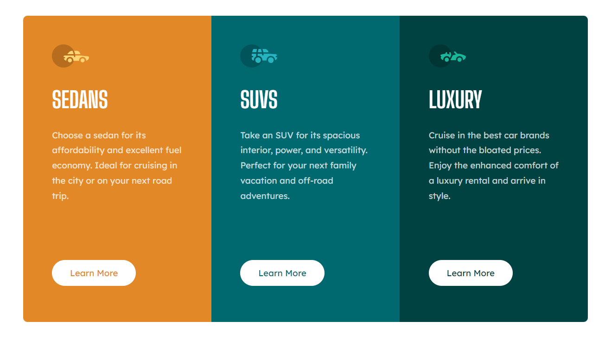

# Frontend Mentor - 3-column preview card component solution

This is a solution to the [3-column preview card component challenge on Frontend Mentor](https://www.frontendmentor.io/challenges/3column-preview-card-component-pH92eAR2-). Frontend Mentor challenges help you improve your coding skills by building realistic projects.

## Table of contents

- [Overview](#overview)
  - [The challenge](#the-challenge)
  - [Screenshot](#screenshot)
  - [Links](#links)
- [My process](#my-process)
  - [Built with](#built-with)
  - [Continued development](#continued-development)

## Overview

### The challenge

Users should be able to:

- View the optimal layout depending on their device's screen size
- See hover states for interactive elements

### Screenshot

| Desktop | Mobile |
| ------- | ------ |
|  |  |

### Links

- Solution URL: [Repo](https://github.com/iArmanKarimi/challenge-3-column-preview-card-component)
- Live Site URL: [Github.io](https://iarmankarimi.github.io/challenge-3-column-preview-card-component)

## My process

### Built with

- Tailwind css
- CSS Grid
- Mobile-first workflow

### Continued development

More responsive
